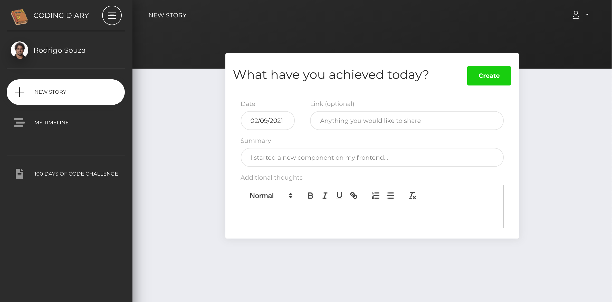

# [Coding Diary](https://diary.rasouza.dev)

 

**[Coding Diary](https://diary.rasouza.dev)** is a platform inspired by [100 days of code](https://www.100daysofcode.com/) challenge where you can keep your development logbook and interact with other participants through their tweets about the project they are on.

## Table of Contents

* [About the challenge](#about-the-challenge)
* [How to contribute](#how-to-contribute)
* [Feature Roadmap](#feature-roadmap)

## About the challenge

See [official website](https://www.100daysofcode.com/) for more details

There's basically 2 main rules:

1. Code minimum an hour every day for the next 100 days.
1. Tweet your progress every day with the *#100DaysOfCode* hashtag

You can use this platform to achieve it!

## How to contribute

1. Fork this repo
1. Create a feature branch of the improvement you want to code
1. Open a Pull Request for this repo
1. Provide a detailed description what your code does and what you want to achieve
1. Wait for Code Review
1. Merge 🙌

## Feature Roadmap

TBD